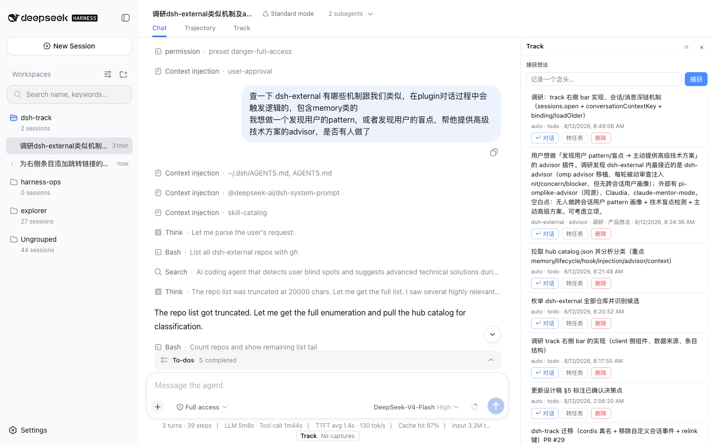

# dsh-track · Track Bridge

[](https://www.npmjs.com/package/@fakechris/dsh-track)
[](https://www.npmjs.com/package/@fakechris/dsh-track)

English | [中文](README.md)

> **The embedded task-management engine for DeepSeek Harness** — turns thoughts, decisions, and tasks
> into structured, traceable, foldable data. Capture with zero friction, decisions leave a trail,
> tasks have a lifecycle. Everything lives inside the harness (session events + storage KV), zero
> external dependencies.

**Status** Active · **Tests** 240 passing · **Build** `pnpm run build` · **Version** 0.5.0
> **v0.5.0 · panel task actions + pager (2026-08-14)**: issue cards gain direct
> 完成/取消 (done/canceled) actions with two-step confirm, plus a batch mode
> (checkboxes + batch done/cancel); pagers gain first-page / page-number jump /
> last-page controls and scroll anchoring (the pager stays put across page
> switches instead of jumping).
> **v0.4.0 · auto-maintenance + config panel (2026-08-14)**: a lifecycle sweep surfaces zombie
> tasks in a pending-confirmation section; capture auto-promotion + near-duplicate auto-merge
> (configurable similarity threshold); canceled proposals auto-confirm past a grace period;
> scheduled sync (weekly v1, capped); a Track-panel settings UI (⚙) backed by /api/track/config.
> lib artifacts are committed; npm publishing runs LOCALLY (IP trust + hardware 2FA) —
> GitHub Actions validates the tag and packs the tarball.
> **v0.3.0 · dedup + panel fixes (2026-08-14)**: no more duplicate entries on the capture wall —
> `createCapture` is the single gate (durable per-session marker + content-hash fallback, survives
> restarts); the right panel/tab are fixed (mounted on the real conversation root in the formal-release
> layout, the Track tab toggles the panel); the composer strip shows the live capture count and opens
> the panel on click.
> **v0.2.1 · final-release compatibility (2026-08-12)**: the official final release
> (snapshots/20260812T172954Z-final-unwatermarked) renamed two surfaces without aliases —
> `SessionQueryService`→`SessionQueryEngine` (dsh-session-query) and `ctx.httpServer`→`ctx.webServer`
> (dsh-host-webserver) — both adapted (tsc + 342 tests + production-equivalent smoke verified).

---

## 🖥️ Screenshots

| Panel overview (capture wall + issue wall on the right) | Jump back to the source prompt (highlighted) |
|---|---|
|  |  |

## ✨ Features

- 🧠 **Capture Wall** — `capture_thought` captures thoughts with zero friction; planning signals
  (`todo_write`) are auto-captured too, and every entry carries its **motivation context** (the
  user request behind it) — never a list of context-free fragments.
- ⚖️ **Decision Ledger** — for irreversible / risky / scope / acceptance decisions, raise a
  decision point first; the user answers with a lightweight choice, and the **choice + rationale**
  are persisted and queryable (answer rate feeds the funnel).
- 📋 **Evidence-driven Lifecycle** — a Linear-compatible issue model with an evidence-driven state
  machine: `done` / `canceled` are **never auto-claimed** — they always require a user nod.
- 🔄 **History Sync** — fold past workspace sessions into epic/issue candidates in one command;
  dry-run by default, written only after confirmation.
- 💰 **Usage Ledger** — the LLM cost (tokens / dollars) of track's own engine calls is metered
  separately; "how many tokens did track spend" is one question away.
- 🖥️ **Web Panel** — a right-hand capture wall + issue wall; every entry has a **「↩ 对话」** link
  that jumps back to the source conversation and the exact original prompt, highlighted.

## 🚀 Quick Start

```sh
# 1. Install the plugin (official form: published dsh; or `dsh plugin ...` if installed)
# npm package (published — recommended):
npx -p @deepseek-ai/dsh dsh plugin --profile web add @fakechris/dsh-track
# git source (fallback):
# npx -p @deepseek-ai/dsh dsh plugin --profile web add github:dsh-external/dsh-track
#    (or a local path: `... add /absolute/path/to/dsh-track`)

# 2. Install the protocol skill (decision-point / task-advance discipline)
mkdir -p ~/.dsh/skills && cp -r skills/dsh-track ~/.dsh/skills/

# 3. Restart dsh web (the guard auto-restarts it); tools mount automatically
dsh web
```

**Verify**: open the panel in the browser (the ◆ button, or the *Track* tab in the session tab
strip) — you should see the **Captures** and **Issues** sections.

## 📖 Core Workflows

| Flow | What | Entry points |
|---|---|---|
| **Capture** | Drop a thought into the wall anytime; agent planning (todo_write) auto-captures with motivation context | `capture_thought` · panel input |
| **Decide** | Raise a decision point for irreversible/risky/value/scope/acceptance choices; the user answers; choice + rationale are persisted | `report_decision_point` → `track_respond_decision` |
| **Task** | Turn requirements into issues; declare the driving session so execution evidence accumulates; the state machine advances, `done` needs a user nod | `track_create_issue` → `track_attach_issue` → `track_update_issue_state` |
| **Review** | Fold past sessions into issue candidates; jump back to any entry's source conversation and original prompt | `track_sync_history` · panel 「↩ 对话」 |

## 🧰 Tools

| Tool | Purpose |
|---|---|
| `capture_thought(content, tags?)` | capture a thought into the wall with zero friction |
| `report_decision_point(question, options, my_preference, rationale, impact, need)` | raise a decision point; the user answers; auto-persisted to the decision ledger |
| `track_respond_decision(decision_id, choice, rationale?)` | record the user's answer (choice + rationale); idempotent; `dismissed` to skip |
| `track_list_decisions(state?, since?, session_id?)` | read decision history (pending / answered / dismissed) |
| `track_create_issue(title, description?, priority?, acceptance?, parent_id?)` | create a Linear-compatible issue |
| `track_attach_issue(issue_id)` | declare the current session is driving an issue; execution evidence is then recorded against it automatically |
| `track_update_issue_state(issue_id, target, note?, confirmed_by_user?)` | propose or confirm a state change; `done` / `canceled` require `confirmed_by_user=true` (never auto-marked) |
| `track_issue_evidence(issue_id)` | read one issue's evidence ledger and inferred state |
| `track_list_issues(team_id?, state?)` | list issues |
| `track_sync_history(workspace?, since?, dry_run?, max_sessions?, engine?)` | fold workspace session history into epic/issue candidates (dry-run by default) |
| `track_usage(since?)` | report LLM cost incurred by the track engine: request counts, token buckets, wall time, estimated cost |
| `track_backfill_captures()` | backfill motivation context on legacy open captures (idempotent, safe to re-run) |

## 🖥️ Web Panel & HTTP API

The panel (`src/client/right-panel.ts`) mounts into the conversation column's right side — plain
DOM injection, no framework:

- **Capture wall**: inline capture, paging, two-step confirmed delete, one-click promote to issue;
- **Issue wall**: grouped by state (in-progress first), expandable details, delete;
- **↩ 对话 (jump back)**: every capture/issue jumps to the source session and the exact original
  user prompt — switches the left conversation, pages into deep history, scrolls to the row with a
  highlight flash; legacy entries without a message id fall back to the session's first user message;
- 20s lightweight auto-refresh, draggable panel width, ◆ floating toggle when collapsed.

HTTP API (the panel's data face, under `/api/track/*`):

| Endpoint | Purpose |
|---|---|
| `GET/POST /api/track/captures` · `DELETE /:id` · `POST /:id/promote` | capture-wall CRUD + promote |
| `GET /api/track/issues` · `DELETE /:id` · `GET /:id/evidence` | issue list / delete / evidence ledger |
| `GET /api/track/decisions?state=&since=&session_id=` | decision history |
| `GET /api/track/usage?since=&limit=` | LLM usage summary + recent records |
| `GET /api/track/funnel` | tool-invocation funnel (capture conversion, etc.) |
| `POST /api/track/sync` | history sync (same as `track_sync_history`) |

## 🏗️ Architecture

**Fat skill + thin harness**: decision criteria and calling discipline live in
[`skills/dsh-track/SKILL.md`](skills/dsh-track/SKILL.md); the harness only registers tools and
storage — it makes no judgment.

**Storage placement**: decision points/todos stay in session events (replayable); Capture / Issue /
Decision / Usage live in `ctx.storage` KV (independent across sessions) with **Linear-compatible
shapes** (migratable anytime).

```
src/index.ts          host plugin: tool registration + event subscription + store wiring + HTTP API
src/store.ts          TrackStore: KV cell wrapper (serial write chain)
src/types.ts          Linear-compatible data shapes
src/capture/          auto-capture + motivation context (observer / context / backfill)
src/lifecycle/        evidence observer + state machine (evidence-driven lifecycle)
src/sync/             history-sync engine (extract → segment → intent → synthesize → align)
src/usage.ts          LLM usage ledger (recorder + aggregation + cost estimation)
src/client/           web panel (right-panel / composer strip)
skills/dsh-track      fat skill: decision-point criteria / format / discipline
cordis.patch.yml      bundle patch (auto-applied by dsh plugin add)
```

**Design constraint (plugin developers, read this)**: do **not** write custom session events for
business data — since 2026-08-11 the harness refuses to read an entire log containing an unknown
event type. Observe sessions only through the official event stream, read-only (see the trailing
comment in `src/types.ts` and the repo AGENTS.md).

## 🛠️ Development

```sh
pnpm install
pnpm run build      # tsc artifacts to lib/ + client bundle
pnpm test           # vitest (188 tests)
```

- Develop in a repo-nested worktree (`.worktrees/<name>`) + branch + PR + squash merge (repo
  `AGENTS.md` L4/L5).
- Adding an `@deepseek-ai/*` dependency requires updating tsconfig paths, vitest aliases, and
  ab-config relink together (L7).

## 📚 Links

- Repo: [github.com/dsh-external/dsh-track](https://github.com/dsh-external/dsh-track)
- Protocol skill: [`skills/dsh-track/SKILL.md`](skills/dsh-track/SKILL.md) (decision-point
  criteria, task-advance discipline)
- Repo conventions: [`AGENTS.md`](AGENTS.md) (commit / worktree / bilingual-docs rules)

## 📄 License

Private plugin repo (`package.json` marks `private`); the skill metadata declares **BSD-3-Clause**.
